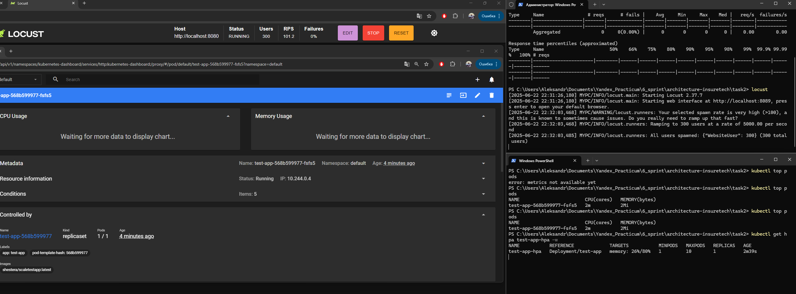
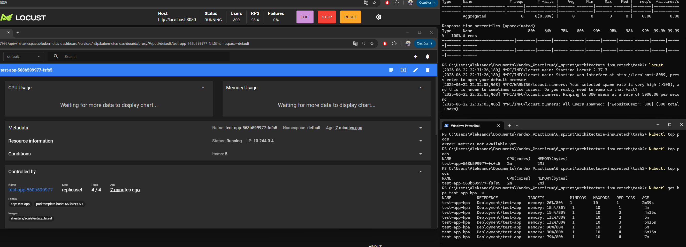

## Приложены три файла:

1. `deployment.yaml` - манифест развёртывания  
2. `service.yaml` - манифест сервиса  
3. `hpa.yaml` - динамическое масштабирование  

Так же немного отступил от требования в 30Mi на приложение, т.к. были ошибки minikube сетевые из-за большого кол-ва реквестов. Решил уменьшить, чтобы проще было достичь результата.

## Скриншоты:

**start.png** - начало нагрузочного тестирования  
**end.png** - добился результата в уменьшении утилизации до 80% и масштабировании до 4х подов. В скришноте так же есть вывод консоли с командой `kubectl get hpa test-app-hpa -w`, который показывает утилизацию и кол-во подов.

  
